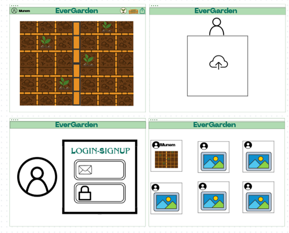
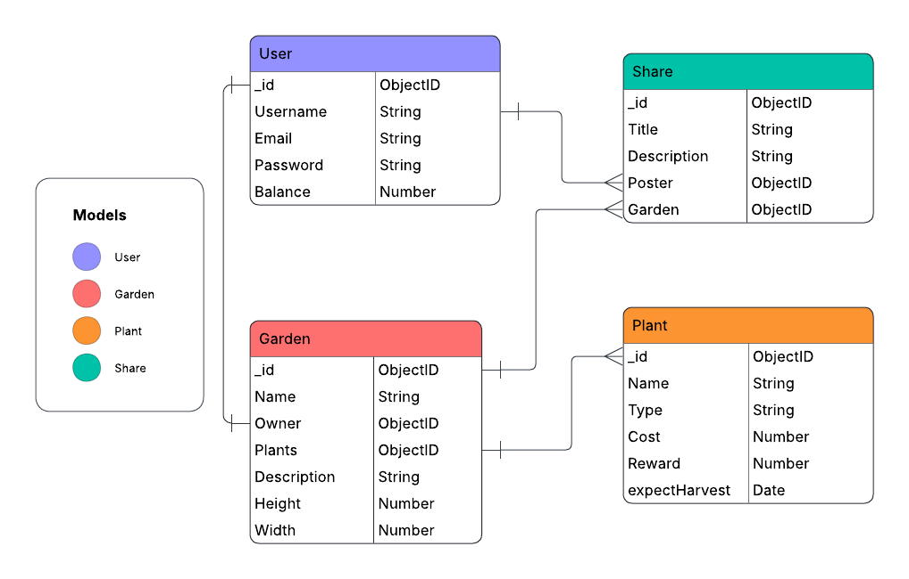
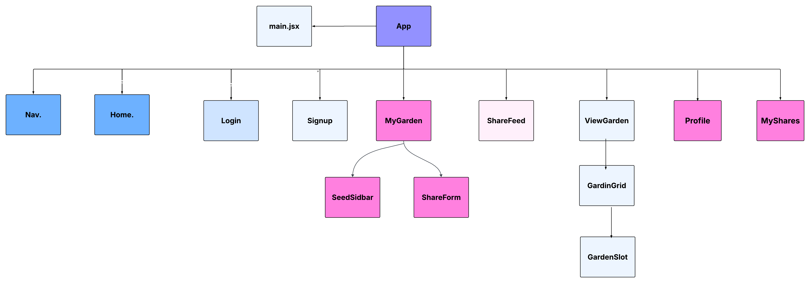

# Project Title:  EverGarden
## Start Date: 10/23/2025
## End Date: 10/30/2025
### By: Shooq Bin Zaiman, Munem Alkhalaf

[Munem Alkhalaf GitHub](https://github.com/AndomiXD) |
[Shooq Bin Zaiman GitHub](https://github.com/shooqbinzaiman)

### Out First MERN-Stack Project

EverGarden is a MERN-stack website that allows users to grow their own garden. Users can purchase seeds, plant them, and harvest them after a period of time to sell them, then use the extra cash to purchase more expensive seeds to earn even bigger rewards. Users can also share their progress to each other, adding a layer of socialising.

#### ***Functional Requirements***
* User can Sign-up & Sign-in
* User can update their password
* User will be provided with a garden upon registration
* User can see and purchase seeds if he chooses to plant them
* User can plant seeds on their garden
* User can remove seeds from their garden and won't be refunded
* User will be notified if their harvest has completed
* User's plants will be harvested upon fully growing if auto harvest is toggled
* User can manually harvest the plants upon fully growing if he clicks
* User will be rewarded after harvesting a plant
* User can share their progress to other users
* User can see all shared posts of all players

A Trello board was used to track development progress and can be viewed [here](https://trello.com/b/tQZMG1jD/evergarden).

### ***Deployed version***
##### [EverGarden]()

### ***Tools & Technologies***
Frontend: React, React Router, Axios

Backend: Node.js, Express.js, MongoDB, Mongoose

Utilities: CORS, Morgan

Version Control: Git & GitHub

Project Management: Trello

### ***Screenshots***

